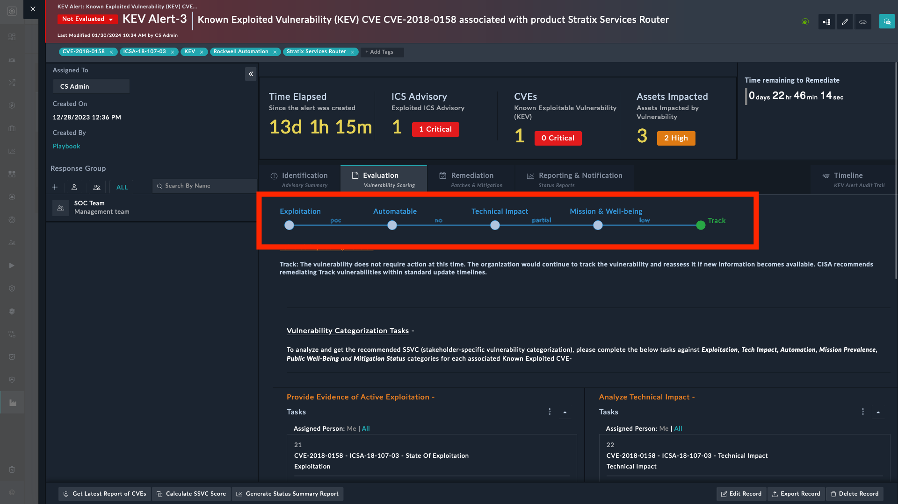
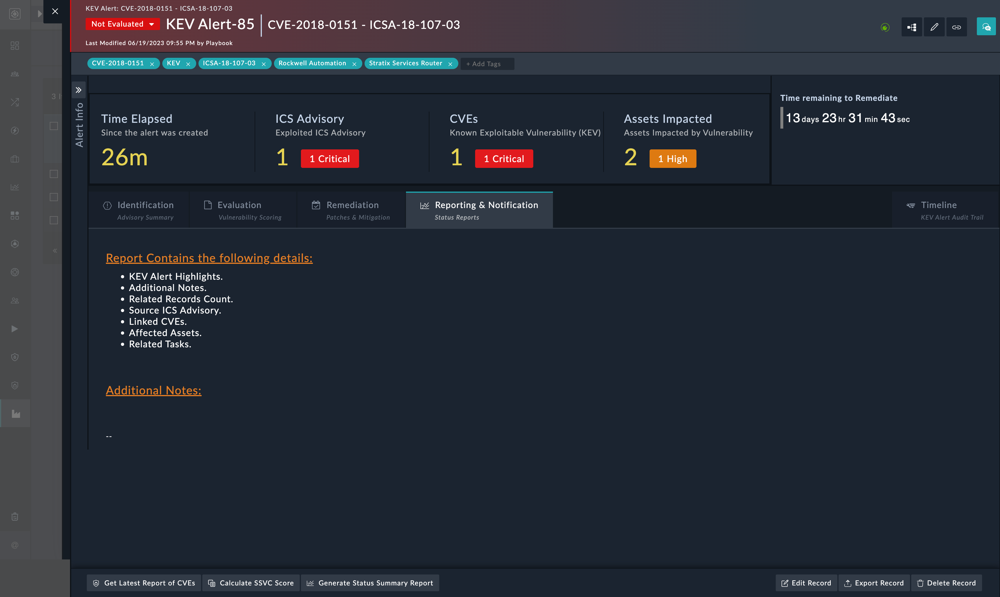

| [Home](../README.md) |
| -------------------- |

# Usage

Refer to [Simulate Scenario documentation](https://github.com/fortinet-fortisoar/solution-pack-soc-simulator/blob/develop/docs/usage.md) to understand how to simulate and reset scenarios.

To understand the process FortiSOAR follows to manage vulnerabilities in Operational Technology (OT), we have included a simulation mode. It provides a solution for handling the Known Exploited Vulnerability (KEV) CVEs under ICS Advisories . We have included a scenario &mdash; **OT - Known Exploit Vulnerability (KVE) Alert Raised For Asset At Risk** with this solution pack.

Refer to the section **OT - Vulnerability Management** to understand how this solution pack automation addresses your needs.

## Simulation mode

<table>
    <tr>
        <th>NOTE</th>
    </tr>
    <tr>
        <td>
            Before using the simulation mode, make the following changes:
            <ol>
                <li>To get latest report of listed CVEs, configure the <strong><em>NIST National Vulnerability Database</em></strong> connector.</li>
                <li>Set global variable <code>Demo_mode</code> to <em><code>true</code></em>. Refer to the section <a href="https://docs.fortinet.com/document/fortisoar/7.4.3/playbooks-guide/488685/dynamic-values#Global_Variables">Global Variables</a> in the <strong>Playbooks Guide</strong> of the platform documentation for more information.</li>
            </ol>
        </td>
    </tr>
</table>

The simulation mode has some sample data that helps you get a better understanding of how the solution pack functions. The following steps help you use the solution pack with the included sample data.

1. Browse to **Simulations** > **OT - Known Exploited Vulnerability (KEV) Alert Raised For Asset At Risk**.

2. Select the scenario and click **Simulate Scenario**.

3. Navigate to **Resources** > **Assets**. Following records are created:
    
    - Stratix Services Router - 6241
    
    - Stratix Services Router - 4121

4. Navigate to **Vulnerability Management** > **CVEs**. Following records are created:

    - CVE-2018-0158

    - CVE-2018-0151

    - CVE-2018-0175

5. Navigate to **OT Vulnerability Management** > **ICS Advisory**. Following record is created:

    - Rockwell Automation Stratix Services Router - (ICSA-18-107-03)

6. Navigate to **OT Vulnerability Management** > **KVE Alerts**. Following records are created:

    - Known Exploited Vulnerability (KEV) CVE CVE-2018-0158 associated with product Stratix Industrial Managed Ethernet

    - Known Exploited Vulnerability (KEV) CVE CVE-2018-0151 associated with product Stratix Industrial Managed Ethernet

    - Known Exploited Vulnerability (KEV) CVE CVE-2018-0175 associated with product Stratix Industrial Managed Ethernet

        <table>
                <th>NOTE</th>
                <td>A <em>KEV alert</em> is created only when the following conditions are met:
                <ul>
                    <li>The CVE listed in <strong>OT - Vulnerability Management</strong> > <strong>ICS advisories</strong> is found in <a href="https://www.cisa.gov/known-exploited-vulnerabilities-catalog">CISA KEV catalog</a>.</li>
                    <li>The associated asset is present in the FortiSOAR&trade; environment.</li>
                </ul>
        </table>

6. Open a KEV alert. The subsequent tasks and actions are available, and must be performed, for **_each KEV alert_**.
    
    1. Click the **Identification** tab. Review the section **Next Steps** to view the steps to be performed.
    
    2. Click the **Evaluation** tab. Each KEV alert has one CVE ID associated with it. CISA has laid down guidelines in the form of the following task categories and tasks which are to be performed for calculation of an SSVC score.

        <table>
            <tr>
                <th>Task categories</th>
                <th>Tasks</th>
            </tr>
            <tr>
                <td>Provide Evidence of Active Exploitation</td>
                <td>State of Exploitation</td>
            </tr>
            <tr>
                <td>Analyze Technical Impact</td>
                <td>Technical Impact</td>
            </tr>
            <tr>
                <td>Is Automatable</td>
                <td>Automatable</td>
            </tr>
            <tr>
                <td>Provide Impact on Mission Essential Functions (MEF)</td>
                <td>Mission Prevalence</td>
            </tr>
            <tr>
                <td>Provide Impact on Public Well-Being</td>
                <td>Public Well-Being Impact</td>
            </tr>
            <tr>
                <td>Provide Status of available Mitigations</td>
                <td>Mitigation Status</td>
            </tr>
        </table>

    3. To complete the tasks, execute one of the following playbooks available for each task. The playbooks appear in the **Execute** button when the task is opened. The following table lists the playbooks and the tasks that it performs:

        <table>
            <tr>
                <th>Playbook Name</th>
                <th>Tasks</th>
            </tr>
            <tr>
                <td>Vulnerability - Provide Evidence of Exploitation</td>
                <td>Provide Evidence of Active Exploitation</td>
            </tr>
            <tr>
                <td>Vulnerability Technical Impact - Provide Status</td>
                <td>Analyze Technical Impact</td>
            </tr>
            <tr>
                <td>Vulnerability Automatable - Provide Decision</td>
                <td>Is Automatable</td>
            </tr>
            <tr>
                <td>Vulnerability - Provide Impact on MEFs</td>
                <td>Provide Impact on Mission Essential Functions (MEF)</td>
            </tr>
            <tr>
                <td>Vulnerability - Provide Public Well-Being Impact</td>
                <td>Provide Impact on Public Well-Being</td>
            </tr>
            <tr>
                <td>Vulnerability Mitigation - Provide Status</td>
                <td>Provide Status of available Mitigations</td>
            </tr>
        </table>

    4. After completing the tasks, execute **Calculate SSVC Score** to determine the score for each KEV CVE. The **Evaluation** tab contains SSVC Score.

        

    5. Click the **Remediation** tab. Review the **Recommended Remediation Tasks**:

        - Make Permanent Configuration Changes

        - Isolating vulnerable systems, applications, services, profiles, or other assets

        - Limiting access

    6. Select **Yes**, **No**, or **Unknown** in the **Remediation** tab for the question &mdash; **Do Patches Exist?**

        - **Yes** - Selecting *Yes* creates a new task **Install Patch**, in the right pane.

        - **No** - Selecting *No* creates following new tasks in the right pane.

            - Increase monitoring to detect exploitation
            - Reconfiguring firewalls to block access
            - Disabling services

        - **Unknown** - Selecting *Unknown* clears all tasks from the right pane.

    7. **Reporting & Notification** tab contains the details of the report and any additional notes to be added to the report.

    8. To create a report, run **Generate Status Summary Report**.

<table>
    <tr>
        <th>NOTE</th>
    </tr>
    <tr>
        <td>
            <ol>
                <li>Mark <strong>Does Patch Exist?</strong> as <strong><em>Unknown</em></strong> before resetting the scenario.</li>
                <li>Reset the scenario before moving to <strong>Production Mode</strong>.</li>
            </ol>
        </td>
    </tr>
</table>

## Production Mode

1. Set global variable `Demo_mode` to *`false`*. Refer to the section [Global Variables](https://docs.fortinet.com/document/fortisoar/7.4.3/playbooks-guide/488685/dynamic-values#Global_Variables) in the **Playbooks Guide** of the platform documentation for more information.</li>

2. In **02 - Use Case - ICS Advisory and CVEs** and **02 - Use Case - KEV Alert** playbook collections, select and mark all the playbooks as **_Active_**.

3. Ingest Known Exploited Vulnerabilities (KEV) CVEs published by *Cybersecurity and Infrastructure Security Agency (CISA)* using any of the following methods:

    - Activate the schedule **Ingest Known Exploited Vulnerabilities (KEV) CVEs** to periodically ingest data.
    
        Alternatively, you can activate and trigger the schedule to initiate ingestion immediately.

    - Execute **Ingest Known Exploited Vulnerabilities (KEV) CVEs** from **Vulnerability Management** > **CVEs** module's list view.

4. Consider the following when ingesting advisories:

    - To get ICS Advisory execute the playbook **Ingest CISA ICS Advisory** available as a button in **OT Vulnerability Management** > **ICS Advisories**.
        - Alternatively, you can activate the schedule **Ingest CISA ICS Advisory** to initiate ingestion periodically.

    - To get ICS Medical Advisory, execute the playbook **Ingest CISA ICS Medical Advisory** available as a button in **OT Vulnerability Management** > **ICS Advisories**.
        - Alternatively, you can activate the schedule **Ingest CISA ICS Medical Advisory** to initiate ingestion periodically.

    - Assets are correlated with ICS Advisories if the asset is found for the same vendor and product as that of the ICS Advisory.

5. A *KEV alert* is created only when the following conditions are met:

    - The CVE listed in **OT - Vulnerability Management** > **ICS advisories** is found in [CISA KEV catalog](https://www.cisa.gov/known-exploited-vulnerabilities-catalog).

    - The associated asset is present in the FortiSOAR&trade; environment.

6. Alternatively, you can create a KEV alert by triggering the **Create KEV Alert** playbook.

    This playbook becomes available on selection of ICS advisories &mdash; under **OT - Vulnerability Management** > **ICS advisories** &mdash; that have been marked *Yes* under **Is In KEV**.

7. Assigned person gets In-App and email notifications on creation of a **KEV alert**.

## KEV Alert SLA Notifications in Accordance with BOD 22-01

To receive SLA reminders and SLA breach notifications, in Accordance with guidelines laid down by [BOD 22-01](https://www.cisa.gov/news-events/directives/bod-22-01-reducing-significant-risk-known-exploited-vulnerabilities), make following changes:

1. Edit the **BOD 22-01 - Notify KEV Alert Report** playbook under the **02 - Use Case - KEV Alert** playbook collection.

2. Edit the **Configuration** playbook step.

3. Specify days remaining in SLA breach in the variable `reminderDayList`. Enter values as a list. For example `[90, 30, 15, 13, 7, 2, 1, 0]`.

4. Specify email addresses to notify in the variable `sendTo`. Enter values as a comma seperated email address. For example `user1@example.com, user2@example.com`.

    

5. Activate the schedule **BOD 22-01: Notify KEV Alert Summary Report** to receive notification emails as per the schedule frequency for each KEV alert.

    - Notification emails are sent to users as per the schedule frequency; however, the KEV Alert Summary report is attached only when the SLA remaining, as per the KEV alert, and values in `reminderDayList`, match.

## OT - Vulnerability Management Views

## ICS Advisory

## KEV Alerts

|  |  |
|:----------------------------------------|:------------------------------------|
| Identification Tab                      | Evaluation Tab                      |

|  |  |
|:-------------------------------------|:--------------------------------|
| Remediation Tab                      | Report Tab                      |

# Next Steps

| [Installation](./setup.md#installation) | [Configuration](./setup.md#configuration) | [Contents](./contents.md) |
|-----------------------------------------|-------------------------------------------|---------------------------|